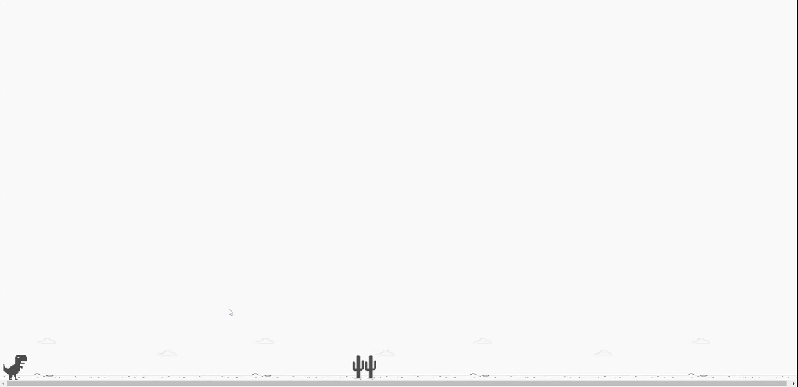
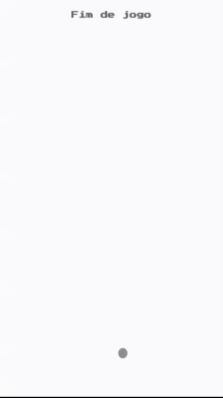

<!-- Badges session -->

  
  <!-- languages -->
  
  <!-- repo size -->
  
  <!-- last commit -->
  
  <!-- licence MIT -->
  

<!--Banner session-->

  

<!--About session-->
<h1 align="center">Recriando o famoso jogo do dinossauro sem internet Digital Innovation One</h1>

Curso do Bootcamp React Native Mobile Developer da [Digital Innovation One](https://digitalinnovation.one/).

Neste projeto você terá o desafio de criar uma cópia do jogo do dinossauro, famoso no Chrome por nos entreter quando estamos sem conexão. Nele iremos utilizar HTML, CSS e JavaScript, abordando de maneira simples diversos conceitos introdutórios importantes para programação na web como tags básicas de HTML, manipulação de eventos, funções e manipulação de elementos HTML usando JavaScript, estilização e animações básicas com CSS.

- [Projeto desenvolvido](https://game-dinossauro.vercel.app/)

<h3>👨‍💻 Tecnologias utilizadas</h3>

- [HTML](https://www.w3schools.com/html/)
- [CSS](https://developer.mozilla.org/pt-BR/docs/Web/CSS)
- [JavaScript](https://developer.mozilla.org/en-US/docs/Web/JavaScript)

<!--License session-->
<h3>📝 Licença</h3>

- Este projeto está sob a licença [MIT](./LICENSE).

<!--Bottom session-->
 <h4 align=center>Made with by <a target="_blank" href="https://pleiterson.vercel.app" >Pleiterson Amorim</a></h4>